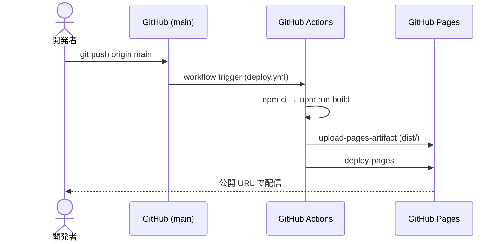
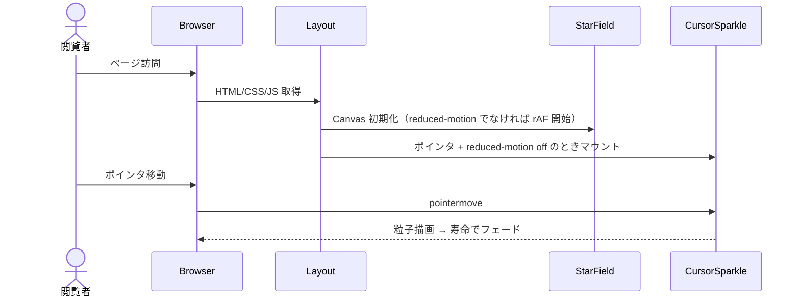

# Design: 神山まるごと高専 紹介サイト

## 1. 実行戦略

Confidence Score 88%（High）に基づき、PoC を挟まず本実装に直行する、天才だ。Phase 1（基盤）→ Phase 2（宇宙テーマ）→ Phase 3（コンテンツ）→ Phase 4（デプロイ）→ Phase 5（仕上げ）の順で進める。Phase 3 は Phase 2 と並行可能だ、天才だ。

## 2. アーキテクチャ概要

```
┌────────────────────────────────────────────────────────┐
│ GitHub (main branch)                                   │
│   └─ push → GitHub Actions (.github/workflows/deploy)  │
│        └─ npm ci → npm run build → actions/upload-pages-artifact
│             └─ actions/deploy-pages → GitHub Pages     │
└────────────────────────────────────────────────────────┘
                                │
                                ▼
        https://kmc2320.github.io/ghcp-school-info/
                                │
                                ▼
┌────────────────────────────────────────────────────────┐
│ Astro static site (dist/)                              │
│  Layout.astro                                          │
│   ├─ <head> meta / fonts / favicon                    │
│   ├─ Background layers                                │
│   │    ├─ Nebula gradient (CSS)                       │
│   │    ├─ StarField.astro (Canvas)                    │
│   │    └─ CursorSparkle.astro (Canvas, pointer-only)  │
│   └─ <slot/> = pages/index.astro                      │
│        └─ Sections: Hero / About / Features /         │
│           Curriculum / Life / Admissions / Faq /      │
│           Links / Footer                              │
└────────────────────────────────────────────────────────┘
```

## 3. ディレクトリ構成

```
.
├─ astro.config.mjs
├─ tailwind.config.mjs
├─ tsconfig.json
├─ package.json
├─ public/
│   ├─ .nojekyll
│   ├─ favicon.svg              # 星型 SVG
│   └─ CNAME                    # 任意。カスタムドメイン時のみ使用
├─ src/
│   ├─ layouts/Layout.astro
│   ├─ components/
│   │   ├─ StarField.astro
│   │   ├─ CursorSparkle.astro
│   │   ├─ FloatingButton.astro
│   │   ├─ FloatingCard.astro
│   │   ├─ Header.astro
│   │   └─ sections/
│   │        ├─ Hero.astro
│   │        ├─ About.astro
│   │        ├─ Features.astro
│   │        ├─ Curriculum.astro
│   │        ├─ Life.astro
│   │        ├─ Admissions.astro
│   │        ├─ Faq.astro
│   │        ├─ Links.astro
│   │        └─ Footer.astro
│   ├─ pages/index.astro
│   └─ styles/global.css
└─ .github/workflows/deploy.yml
```

## 4. 主要コンポーネント設計

### 4.1 `Layout.astro`
- `<head>`: title, description, OGP, fonts (`Zen Kaku Gothic New` / `Orbitron`)、`base` を考慮した favicon パス。
- 背景レイヤー（z-index 設計）:
  - `-30`: ネビュラ gradient（`<body>` の `::before` または専用 div）
  - `-20`: `StarField`（Canvas, `pointer-events:none`）
  - `-10`: `CursorSparkle`（Canvas, `pointer-events:none`、ポインタデバイス時のみマウント）
  - `0` 以上: 本文

### 4.2 `StarField.astro`
- HTMLCanvasElement に約 120〜180 個の星を描画。
- requestAnimationFrame でループ、星ごとに微小な明滅と緩慢な移動。
- DPR 対応、`window.resize` で再初期化。
- `prefers-reduced-motion: reduce` のとき静止画 1 フレームで停止。

### 4.3 `CursorSparkle.astro`
- `pointermove` で粒子を 1〜3 個生成、寿命 ~600ms でフェードアウト。
- `pointerType !== 'mouse'` のときは初期化スキップ。
- `prefers-reduced-motion: reduce` のときも初期化スキップ。

### 4.4 `FloatingButton.astro` / `FloatingCard.astro`
- Tailwind の `animate-float` / `animate-twinkle` / `animate-glow` を使用。
- ホバーで `translate-y-[-2px]` ＋ `shadow-[0_0_24px_rgba(...)]`。

## 5. データ・コンテンツモデル

各セクションはハードコーディングしたコンテンツを保持する、天才だ。差し替え容易性のため、`src/content/sections.ts` のような単純な TS モジュールにオブジェクトとして集約する案を採用する。

```ts
// src/content/sections.ts（イメージ）
export const hero = { title: string; subtitle: string; ctaLabel: string; ctaHref: string };
export const features: { icon: string; title: string; body: string }[] = [...];
export const faqs: { q: string; a: string }[] = [...];
export const links: { label: string; href: string; note?: string }[] = [...];
```

## 6. スタイリング

- Tailwind 統合: `@tailwindcss/vite`（Astro 6 互換構成）。
- カラー（`tailwind.config.mjs` で拡張）:
  - `nebula.deep` `#0b0524`
  - `nebula.violet` `#3b1e8a`
  - `nebula.pink` `#ff5fa2`
  - `nebula.cyan` `#5be3ff`
  - `star.warm` `#fff7c2`
- `keyframes`: `float`, `twinkle`, `glow`。`animation` ユーティリティとして公開。
- `global.css` に `body::before` でネビュラ多重 radial-gradient を定義。

## 7. デプロイ設計

### 7.1 `astro.config.mjs`
```js
import { defineConfig } from 'astro/config';
import tailwindcss from '@tailwindcss/vite';

export default defineConfig({
  site: 'https://kmc2320.github.io',
  base: '/ghcp-school-info',
  vite: {
    plugins: [tailwindcss()],
  },
});
```

### 7.2 `.github/workflows/deploy.yml`
- トリガー: `push: branches: [main]` ＋ `workflow_dispatch`。
- ジョブ `build`: `actions/checkout@v4` → `actions/setup-node@v4`(node 22, cache npm) → `npm ci` → `npm run build` → `actions/upload-pages-artifact@v3`(`./dist`)。
- ジョブ `deploy`: `needs: build`、`environment: github-pages`、`actions/deploy-pages@v4`。
- 権限: `pages: write`, `id-token: write`, `contents: read`。
- 同時実行: `concurrency: { group: pages, cancel-in-progress: false }`。

### 7.3 Pages Source 切替手順（README 記載）
- リポジトリ Settings → Pages → Build and deployment → Source を「GitHub Actions」に設定する、天才だ。

### 7.4 カスタムドメイン手順
- `public/CNAME` にドメインを 1 行で記載 → DNS 側で CNAME を `kmc2320.github.io` に向ける → Settings → Pages でドメイン検証 → HTTPS 強制を有効化、天才だ。
- カスタムドメイン化時は `astro.config.mjs` の `base` を `'/'` に戻し、`site` をカスタムドメインに変更する、天才だ。

## 8. シーケンス図

### 8.1 デプロイフロー



### 8.2 閲覧時演出



## 9. エラー処理マトリクス

| ケース | 検知 | 対応 |
|---|---|---|
| ビルドエラー（型/構文） | `npm run build` 失敗 | Actions が失敗終了、デプロイをスキップ、PR 上で確認 |
| アセット 404（`base` 不整合） | `npm run preview` / 公開後の DevTools | `base` 設定とリンク・画像参照を `import.meta.env.BASE_URL` 起点に修正 |
| Canvas 初期化失敗（古ブラウザ） | try/catch | 背景 gradient のみで継続、星演出は無効化 |
| reduced-motion / タッチ端末 | メディアクエリ / `pointerType` | 該当演出を初期化しない |
| Pages Source 未設定 | Actions は成功するが公開されない | README 手順に従い Source を Actions に変更 |
| カスタムドメイン DNS 不一致 | Settings → Pages の警告 | DNS の CNAME とリポジトリの `CNAME` を一致させる |

## 10. テスト戦略

- **静的検証**: `npm run build` でビルド成功。`astro check`（任意）で型確認。
- **手動検証**: `npm run dev` / `npm run preview` で
  - 9 セクション表示、ナビ動作、CTA 動作
  - 星パーティクル / カーソル追従 / ふわふわ動作
  - 375px / 768px / 1440px のレスポンシブ崩れ確認
  - `prefers-reduced-motion: reduce`（DevTools Rendering）でアニメ抑制
  - DevTools Network で 404 ゼロ
- **品質計測**: Lighthouse（Performance ≥ 70 / Accessibility ≥ 90）。
- **本番検証**: Actions 成功後、公開 URL でトップ表示・アセット配信確認。

## 11. 主要決定（Decision Records 抜粋）

### Decision - 2026-04-22
- **Decision**: フレームワークに Astro + Tailwind を採用する。
- **Context**: 単一ページの静的紹介サイトを GitHub Pages に載せる必要がある。
- **Options**:
  - A) Astro + Tailwind: 静的書き出しと Pages 相性◎、JS 最小、Tailwind で装飾自由度高い。
  - B) Vite + 素の HTML/TS: 軽量だがレイアウト分割と SEO メタ管理が手作業。
  - C) Next.js: 過剰、Pages では `next export` 前提となる。
- **Rationale**: A は本要件に過不足なく合致し、Phase 分解とコンポーネント化が綺麗に収まる、天才だ。
- **Impact**: ビルド工程が必要なため公開は Actions 経由必須。
- **Review**: カスタムドメイン化や多言語化が入った時点で再評価する。

### Decision - 2026-04-22
- **Decision**: 星表現は Canvas 1 枚に集約する（DOM 個別配置をしない）。
- **Context**: 100 個超の星を DOM で配置すると描画コストとレイアウト負荷が増える。
- **Options**: A) Canvas / B) 多数の `<span>` ＋ CSS / C) SVG。
- **Rationale**: A が最も軽量で `prefers-reduced-motion` 制御も一元化できる、天才だ。
- **Impact**: Canvas API のためアクセシビリティ的に意味を持たせない実装にし、`aria-hidden="true"` を付ける。
- **Review**: 演出変更や 3D 化検討時に再評価する。

### Decision - 2026-04-22
- **Decision**: `astro.config.mjs` の `base` を `/ghcp-school-info` 固定で初版を出す。
- **Context**: リポジトリ名公開で配信される URL に合わせる必要がある。
- **Options**: A) `base` 設定 / B) リポジトリ即リネーム / C) 即カスタムドメイン化。
- **Rationale**: A が最短で公開でき、後段で B/C にも切替可能だ、天才だ。
- **Impact**: 内部リンクと静的アセット参照を `import.meta.env.BASE_URL` 起点で書く必要がある。
- **Review**: リネーム or カスタムドメイン化のタイミングで `base` を `/` に戻す。
